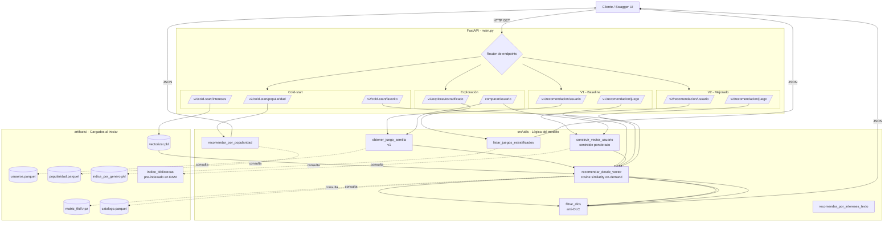
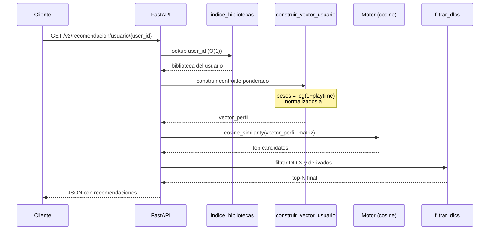

# 🎮 Sistema Recomendador de Videojuegos — Steam

Sistema de recomendación de videojuegos sobre la plataforma Steam, basado en
filtrado por contenido (TF-IDF + similitud de coseno) con dos versiones del
modelo expuestas en paralelo a través de una API REST construida con FastAPI.

---

## 📚 Referencias del Dataset

El proyecto utiliza el dataset **Steam Video Game and Bundle Data** publicado
por Julian McAuley (UCSD).

- **Sitio del dataset:** [https://cseweb.ucsd.edu/~jmcauley/datasets.html#steam_data](https://cseweb.ucsd.edu/~jmcauley/datasets.html#steam_data)
- **Autor:** Julian McAuley — University of California, San Diego.
- **Archivos utilizados en este proyecto:**
  - `steam_games.parquet` — catálogo de juegos con metadatos (géneros, tags,
    specs, developer, publisher, precio).
  - `australian_users_items.parquet` — bibliotecas de usuarios australianos con
    horas jugadas por título (`playtime_forever`).

### Publicaciones asociadas

- Pablo Castells, Saúl Vargas & Jun Wang. *Novelty and Diversity Metrics for
  Recommender Systems: Choice, Discovery and Relevance.* DDR @ ECIR 2011.
- Mengting Wan & Julian McAuley. *Item Recommendation on Monotonic Behavior
  Chains.* RecSys 2018.
- Apurva Pathak, Kshitiz Gupta & Julian McAuley. *Generating and Personalizing
  Bundle Recommendations on Steam.* SIGIR 2017.

### Otras referencias técnicas

- Salton, G., & Buckley, C. (1988). *Term-weighting approaches in automatic
  text retrieval.* Information Processing & Management, 24(5), 513–523.
- Lops, P., De Gemmis, M., & Semeraro, G. (2011). *Content-based recommender
  systems: State of the art and trends.* Recommender Systems Handbook, 73–105.
- Carbonell, J., & Goldstein, J. (1998). *The use of MMR, diversity-based
  reranking for reordering documents and producing summaries.* SIGIR, 335–336.

---

## 🚀 Cómo correr la aplicación

### Requisitos previos

- Python 3.11+
- [uv](https://docs.astral.sh/uv/) (gestor de dependencias recomendado)
- Los archivos parquet del dataset en la carpeta `data/`.

### Instalación

```bash
# Clonar el repositorio
git clone <url-del-repo>
cd <carpeta-del-repo>

# Crear entorno virtual e instalar dependencias
uv venv --python 3.11
uv sync
```

### Generar los artefactos del modelo

Antes de levantar la API hay que entrenar el modelo y generar los artefactos
que la API carga en memoria al arrancar. Esto se hace ejecutando los
notebooks **una sola vez**:

```bash
uv run jupyter lab
```

Y dentro de Jupyter, ejecutar:

1. `sistema_recomendacion.ipynb` (versión 1, baseline) — opcional.
2. `sistema_recomendacion_v2.ipynb` (versión 2, con todas las mejoras) — **requerido**.

Esto crea la carpeta `artifacts/` con los siguientes archivos:

| Artefacto | Descripción |
|-----------|-------------|
| `matriz_tfidf.npz` | Matriz dispersa de juegos × vocabulario (TF-IDF). |
| `catalogo.parquet` | Catálogo de juegos modelables. |
| `usuarios.parquet` | Bibliotecas de usuarios en formato long. |
| `popularidad.parquet` | Ranking precomputado de popularidad. |
| `indice_por_genero.pkl` | Diccionario `{género: [item_ids]}` para estratificación. |
| `vectorizer.pkl` | Vectorizador entrenado (necesario para cold-start textual). |

### Levantar la API

```bash
uv run uvicorn main:app --reload
```

La API queda disponible en `http://localhost:8000`. La documentación
interactiva (Swagger UI) se abre en `http://localhost:8000/docs`.

### Endpoints disponibles

#### Información

- `GET /` — Información general de la API y listado de endpoints.

#### Versión 1 — Baseline

- `GET /v1/recomendacion/usuario/{user_id}` — Top-N juegos para un usuario,
  basado en su juego con mayor `playtime_forever`. **Sin filtros.**
- `GET /v1/recomendacion/juego/{item_id}` — Top-N juegos similares a uno dado.

#### Versión 2 — Modelo mejorado

- `GET /v2/recomendacion/usuario/{user_id}` — Top-N usando centroide ponderado
  de toda la biblioteca + filtro anti-DLC.
- `GET /v2/recomendacion/juego/{item_id}` — Similares a un juego, con filtro anti-DLC.

#### Versión 2 — Estrategias de cold-start

- `GET /v2/cold-start/popularidad` — Top-N juegos más populares.
- `GET /v2/cold-start/intereses?intereses=...` — Recomendación a partir de
  intereses descritos en texto libre (ej: `?intereses=action shooter multiplayer`).
- `GET /v2/cold-start/favorito/{item_id}` — Recomendación a partir de un juego
  de referencia que al usuario le guste.

#### Versión 2 — Exploración

- `GET /v2/explorar/estratificado?k_por_genero=3&generos=action,rpg,strategy` —
  Listado balanceado por género para descubrimiento variado.

#### Comparativo

- `GET /comparar/usuario/{user_id}` — Devuelve recomendaciones de v1 y v2 lado
  a lado para evaluación cualitativa.

---

## 🧠 Estrategia utilizada

### Núcleo del sistema: Filtrado Basado en Contenido

El sistema se construye sobre dos técnicas complementarias:

**1. Filtrado Basado en Contenido (Content-Based Filtering).**
Cada juego se representa como un vector numérico en un espacio TF-IDF
construido a partir de sus metadatos textuales (`tags`, `specs`, `developer`).
TF-IDF (Term Frequency–Inverse Document Frequency) penaliza los tokens muy
comunes (como `indie` o `action`, que aparecen en miles de juegos) y premia
los tokens distintivos (como `roguelike`, `cyberpunk`, `metroidvania`).

**2. Similitud de Coseno (Item-Item Similarity).**
Dada la representación vectorial de los juegos, las recomendaciones se
generan calculando la similitud de coseno entre el vector consulta y todos
los juegos del catálogo.

### Por qué este enfoque

| Criterio | Justificación |
|----------|--------------|
| Disponibilidad de datos | El catálogo tiene metadatos densos para casi todos los juegos. No dependemos de la densidad de interacciones usuario-ítem. |
| Naturaleza de los ítems | Los videojuegos se definen bien por sus géneros y etiquetas. |
| Escalabilidad | Operación O(N·V) por consulta. No requiere GPU ni entrenamiento iterativo. |
| Interpretabilidad | Cada recomendación se explica por los tokens compartidos. |
| Cold-start de ítems | Un juego nuevo con metadatos puede recomendarse de inmediato. |

### Estrategias descartadas

| Estrategia | Razón |
|-----------|-------|
| Filtrado colaborativo puro | Matriz usuario-ítem extremadamente dispersa. |
| Factorización de matrices (SVD/ALS) | Requiere optimización iterativa. Documentado como mejora futura. |
| Neural Collaborative Filtering | Complejidad innecesaria para un prototipo; menor interpretabilidad. |
| Basado en conocimiento | No hay reglas de dominio explícitas en el dataset. |
| Basado en contexto | No hay datos contextuales (ubicación, hora, dispositivo). |

### Evolución del modelo: V1 → V2

| Componente | V1 (baseline) | V2 (mejorado) |
|------------|--------------|---------------|
| Perfil del usuario | Un único juego (max playtime) | Centroide ponderado por log(playtime) sobre toda la biblioteca |
| Diversidad del top-N | Sin filtros (saturado de DLCs) | Filtro anti-DLC (Nivel 1: nombre incluye semilla; Nivel 3: palabras-DLC) |
| Cold-start | No soportado (HTTP 404) | 3 estrategias: popularidad, intereses textuales, juego favorito |
| Exploración | No existe | Listado estratificado por género |
| Performance API | Filtros lineales O(N) por request | Pre-indexación de bibliotecas O(1) |

### Análisis empírico de features

Durante el feature engineering se analizó el solapamiento entre las columnas
`tags` y `genres` del catálogo y se descubrió que el **98% de los juegos**
tienen todos sus géneros oficiales contenidos también como tags comunitarios
(cobertura promedio = 0.989). Por esa razón se asignó peso 0 a `genres` y se
amplificó el peso de `tags` en el `metadata_combined`. Este detalle está
documentado en la sección 3.5 del notebook v1.

---

## 📐 Diagrama de flujo de la API (Mermaid)



### Pipeline interno de una recomendación V2



---

## ⚠️ Retos encontrados y sesgos identificados

### Problemas técnicos del dataset

**1. Strings serializados en columnas anidadas.**
Los parquet del dataset vienen con las columnas `genres`, `tags`, `specs` e
`items` codificadas como **strings que representan estructuras Python**
(ej: `"['Action', 'Indie']"` en lugar de la lista real). Esto se debe a un
paso intermedio de serialización que aplanó tipos complejos. Se resolvió con
una función `_parsear_literal` basada en `ast.literal_eval` aplicada como paso
inicial de saneamiento.

**2. Doble visualización engañosa con `pandas.head()`.**
Inicialmente se pensó que la columna `items` tenía doble anidación
(`[[dict, dict]]`) por la forma en que pandas truncaba el output. La
inspección con `type(...)` y `len(...)` reveló que era un único string
serializado.

**3. Solapamiento alto entre `tags` y `genres`.**
El análisis de Jaccard reveló que el 98% de los juegos tienen sus géneros
contenidos como tags. Incluir ambos en el TF-IDF inflaba artificialmente
los tokens genéricos sin aportar señal nueva.

### Sesgos del sistema recomendador

#### 1. Sesgo de popularidad

Los juegos masivos (Counter-Strike, Dota 2, Team Fortress 2) aparecen en una
proporción desmesurada de bibliotecas. El fallback de popularidad recomienda
siempre los mismos títulos AAA, perpetuando la invisibilidad de juegos indie
y de nicho. Sigue una distribución **Long Tail** clásica donde el top 20% de
juegos acumula la gran mayoría de las interacciones.

**Mitigaciones aplicadas:**
- En lugar de un único endpoint global de popularidad, se ofrece el endpoint
  `/v2/explorar/estratificado` que toma K juegos por género — esto rompe el
  sesgo dando visibilidad a juegos populares dentro de cada nicho.
- El filtro anti-DLC también ayuda evitando que el top esté saturado por
  contenido derivado del juego más popular.

**Mitigaciones futuras:**
- Re-ranking con MMR (Maximal Marginal Relevance) para balancear relevancia y
  diversidad.
- Estrategia ε-greedy: recomendar ocasionalmente juegos aleatorios para
  romper el ciclo de retroalimentación.

#### 2. Sesgo de selección — Dataset australiano

El dataset proviene del archivo `australian_users_items`, que contiene
exclusivamente bibliotecas de **usuarios australianos**. Esto introduce un
sesgo geográfico y cultural relevante:

- Los hábitos de juego australianos no representan a la comunidad global de
  Steam.
- Juegos populares en regiones específicas (Asia, Latinoamérica, Europa del
  Este) están subrepresentados.
- Las reviews están sesgadas hacia el inglés.

**Mitigaciones futuras:**
- Complementar con datasets de otras regiones disponibles en el repositorio
  de McAuley.
- Incluir el dataset `steam_new` con reviews de usuarios más diversos
  geográficamente.

#### 3. Sesgo de exposición

Solo observamos interacciones con juegos que los usuarios ya descubrieron y
decidieron comprar. No tenemos información sobre juegos que les **gustarían
pero nunca vieron**. El sistema queda sesgado hacia juegos con buena
visibilidad en la tienda (destacados, ofertas, marketing).

#### 4. Sesgo de feedback implícito

Se usa `playtime_forever` como señal de preferencia, pero un playtime alto no
siempre indica gusto:

- Juegos con mecánicas *idle* o *AFK farming* generan playtime artificial.
- Juegos comprados y abandonados quedan registrados con `playtime > 0`.
- No se distingue tiempo activo de tiempo en segundo plano.

**Mitigaciones aplicadas:**
- Suavizado logarítmico `log(1 + playtime)` en el centroide de v2: atenúa el
  peso desproporcionado de outliers (10000h vs 100h pasa de ser 100× más
  importante a ~2× más).

**Mitigaciones futuras:**
- Combinar `playtime_forever` con la columna `recommend` del dataset de
  reviews para descartar juegos que el usuario marcó negativamente.
- Establecer umbral mínimo de playtime para considerar una interacción
  significativa.

#### 5. Sesgo de contenido — Géneros sobrerrepresentados

El catálogo de Steam está dominado por ciertos géneros: "Indie" aparece en
~40% de los juegos, seguido de "Action" y "Casual". TF-IDF mitiga
parcialmente esto penalizando términos frecuentes, pero géneros minoritarios
(Education, Documentary) tienen menos oportunidades de ser recomendados.

#### 6. Limitación con metadatos pobres

Se observó que juegos con etiquetas muy genéricas (ej. `["Action", "Casual",
"Indie", "Simulation", "Strategy"]` sin tags más específicos) producen
recomendaciones de baja calidad: la similitud coseno los empareja con
similitud >0.9 con cualquier otro juego de tags igualmente genéricos, sin
capturar afinidades temáticas reales.

**Mitigaciones futuras:**
- Imponer un umbral mínimo de "especificidad" (número de tags con IDF alto)
  para considerar un juego modelable.
- Enriquecer metadatos pobres mediante scraping adicional de descripciones de
  Steam.

---

## 📂 Estructura del proyecto

```
proyecto/
├── README.md
├── requirements.txt
├── main.py                              # API FastAPI (v1 + v2 unificados)
├── sistema_recomendacion.ipynb          # Notebook v1 (baseline)
├── sistema_recomendacion_v2.ipynb       # Notebook v2 (modelo mejorado)
│
├── data/                                # Datasets crudos
│   ├── steam_games.parquet
│   └── australian_users_items.parquet
│
├── artifacts/                           # Generados por los notebooks
│   ├── matriz_tfidf.npz
│   ├── catalogo.parquet
│   ├── usuarios.parquet
│   ├── popularidad.parquet
│   ├── indice_por_genero.pkl
│   └── vectorizer.pkl
│
└── src/
    └── utils/
        ├── __init__.py
        ├── limpieza.py                  # Saneamiento y limpieza
        ├── solapamiento.py              # Análisis Jaccard tags vs genres
        ├── preparacion_metadata.py      # Feature engineering
        ├── calculo_similitud.py         # Motor v1
        ├── perfil_usuario.py            # Centroide ponderado v2
        ├── motor_v2.py                  # Motor v2
        ├── filtros.py                   # Anti-DLC
        ├── cold_start.py                # 3 estrategias de cold-start
        └── estratificacion.py           # Listado por género
```

---

## 🔮 Trabajo futuro

| Mejora | Descripción | Complejidad |
|--------|-------------|-------------|
| MMR (Maximal Marginal Relevance) | Re-ranking que balancea relevancia con diversidad. | Baja |
| Hybrid model | Combinar content-based con collaborative filtering (matriz de co-ocurrencia o ALS). | Media |
| Análisis de sentimiento | Procesar el texto de reviews para ajustar pesos del centroide más allá del booleano `recommend`. | Media-Alta |
| Recency con `playtime_2weeks` | Doble vector perfil: gusto histórico vs gusto actual. | Baja |
| Embeddings semánticos | Sustituir TF-IDF por embeddings de descripciones (sentence-transformers). | Alta |
| Neural Collaborative Filtering | Modelo de deep learning para capturar interacciones no lineales usuario-juego. | Alta |
