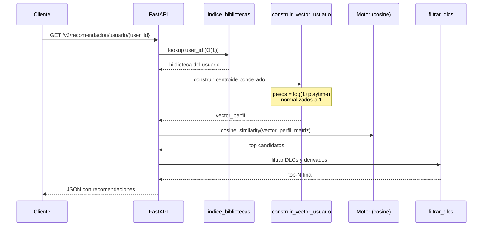

# 🎮 Sistema Recomendador de Videojuegos — Steam

## 👥 Integrantes

| Nombre                 |
| ---------------------- |
| Andrés Felipe González |
| William Suaza          |
| Camilo Camero          |

**Asignatura:** Introducción al Diseño de Sistemas Recomendadores  
**Programa:** Maestría en Inteligencia Artificial

---

## 🌐 Aplicación Web

> **Acceso directo:** [https://wills777-sistemarecomendador.hf.space/app/](https://wills777-sistemarecomendador.hf.space/app/)

La aplicación está desplegada gratuitamente en Hugging Face Spaces con Docker.

---

## 🧩 Conceptos Técnicos Aplicados

El proyecto integra los siguientes conceptos del campo de sistemas
recomendadores:

| Concepto                                          | Descripción y aplicación en el proyecto                                                                                             |
| ------------------------------------------------- | ----------------------------------------------------------------------------------------------------------------------------------- |
| **Filtrado Basado en Contenido**                  | Estrategia principal: cada juego se representa por sus metadatos textuales y se recomienda en función de la similitud de contenido. |
| **TF-IDF (Term Frequency–Inverse Document Freq)** | Vectorización del catálogo de juegos a partir de tags, specs y developer. Penaliza tokens genéricos y premia tokens distintivos.    |
| **Similitud de Coseno**                           | Métrica para comparar vectores de juegos y perfiles de usuario en el espacio TF-IDF. Se calcula on-demand para cada consulta.       |
| **Centroide Ponderado (User Profile)**            | V2 construye el perfil del usuario como promedio ponderado (por log-playtime) de todos sus juegos, capturando el gusto agregado.    |
| **Feedback Implícito**                            | Uso de `playtime_forever` como señal de preferencia en ausencia de ratings explícitos.                                              |
| **Suavizado Logarítmico del Playtime**            | `log(1 + playtime)` para atenuar outliers extremos en el feedback implícito (10,000h vs 100h → ~2× en vez de 100×).                 |
| **Feature Engineering con Pesos**                 | Asignación de pesos diferenciados a cada tipo de metadato: tags ×3, developer ×2, specs ×1, genres ×0 (redundante según Jaccard).   |
| **Análisis de Solapamiento (Jaccard)**            | Estudio de la redundancia entre `tags` y `genres`: el 98% de juegos tienen sus géneros contenidos como tags, justificando peso 0.   |
| **Cold-Start (Arranque en Frío)**                 | Tres estrategias para usuarios nuevos sin historial: popularidad global, intereses textuales y selección de juegos favoritos.       |
| **Estratificación por Género**                    | Listados balanceados que toman K juegos por cada género para romper el sesgo de popularidad y garantizar diversidad.                |
| **Filtro Anti-DLC (Post-procesamiento)**          | Heurística en dos niveles (nombre contenido + palabras clave DLC) para excluir contenido descargable del top de recomendaciones.    |
| **Sesgo de Popularidad**                          | Identificado y mitigado parcialmente con estratificación por género y filtro anti-DLC.                                              |
| **Burbuja de Filtro**                             | Limitación inherente del content-based. Se propone MMR como mejora futura.                                                          |
| **Sesgo de Selección (Geográfico)**               | Dataset exclusivamente australiano; limita la generalización global.                                                                |
| **Sesgo de Exposición**                           | Juegos con más visibilidad en la tienda acumulan más playtime, confundiendo exposición con preferencia.                             |
| **Evaluación Cualitativa (A/B lado a lado)**      | Comparativo que muestra V1 vs V2 para un mismo usuario, permitiendo inspección visual de las diferencias.                           |

---

## 📚 Referencias del Dataset

El proyecto utiliza el dataset **Steam Video Game and Bundle Data** publicado
por Julian McAuley (UCSD).

- **Sitio del dataset:** [https://cseweb.ucsd.edu/~jmcauley/datasets.html#steam_data](https://cseweb.ucsd.edu/~jmcauley/datasets.html#steam_data)
- **Autor:** Julian McAuley — University of California, San Diego.
- **Archivos utilizados en este proyecto:**
  - `steam_games.parquet` — catálogo de juegos con metadatos (géneros, tags,
    specs, developer, publisher, precio).
  - `australian_users_items.parquet` — bibliotecas de usuarios australianos con
    horas jugadas por título (`playtime_forever`).

### Publicaciones asociadas

- Pablo Castells, Saúl Vargas & Jun Wang. _Novelty and Diversity Metrics for
  Recommender Systems: Choice, Discovery and Relevance._ DDR @ ECIR 2011.
- Mengting Wan & Julian McAuley. _Item Recommendation on Monotonic Behavior
  Chains._ RecSys 2018.
- Apurva Pathak, Kshitiz Gupta & Julian McAuley. _Generating and Personalizing
  Bundle Recommendations on Steam._ SIGIR 2017.

### Otras referencias técnicas

- Salton, G., & Buckley, C. (1988). _Term-weighting approaches in automatic
  text retrieval._ Information Processing & Management, 24(5), 513–523.
- Lops, P., De Gemmis, M., & Semeraro, G. (2011). _Content-based recommender
  systems: State of the art and trends._ Recommender Systems Handbook, 73–105.
- Carbonell, J., & Goldstein, J. (1998). _The use of MMR, diversity-based
  reranking for reordering documents and producing summaries._ SIGIR, 335–336.

---

## 🚀 Cómo correr la aplicación

### Requisitos previos

- Python 3.11+
- [uv](https://docs.astral.sh/uv/) (gestor de dependencias recomendado)
- Los archivos parquet del dataset en la carpeta `data/`.

### Instalación

```bash
# Clonar el repositorio
git clone <url-del-repo>
cd <carpeta-del-repo>

# Crear entorno virtual e instalar dependencias
uv venv --python 3.11
uv sync
```

### Generar los artefactos del modelo

La API depende de un conjunto de artefactos precomputados (matrices, índices
y rankings) que se generan al ejecutar los notebooks. **Si clonas el repositorio,
los artefactos ya están incluidos** y no necesitas regenerarlos: puedes saltar
directamente a levantar la API.

Si por el contrario deseas reentrenar el modelo desde cero o experimentar con
cambios, debes:

**1. Descargar los datasets originales.** Los archivos no se incluyen en el
repositorio porque su tamaño excede los límites de Git. Se obtienen desde la
fuente oficial (ver sección **Referencias del Dataset**), se convierten a
formato parquet y se colocan en una carpeta `data/` en la raíz del proyecto.
Si la carpeta no existe, créala manualmente.

**2. Ejecutar los notebooks.** Para abrir y ejecutar los archivos `.ipynb`
desde VS Code es necesario tener instalada la extensión oficial de **Jupyter**
(publicada por Microsoft) en el marketplace. Una vez instalada, VS Code permite
ejecutar las celdas seleccionando el intérprete del entorno virtual del proyecto.

Los notebooks a ejecutar son:

1. `sistema_recomendacion_content_based.ipynb` (versión 1, baseline) —
   _opcional_, sirve como referencia del proceso evolutivo del modelo.
2. `sistema_recomendacion_v2.ipynb` (versión 2, modelo final) — **requerido**
   para generar los artefactos que consume la API.

Al finalizar la ejecución se crea la carpeta `artifacts/` con los siguientes archivos:

| Artefacto               | Descripción                                                 |
| ----------------------- | ----------------------------------------------------------- |
| `matriz_tfidf.npz`      | Matriz dispersa de juegos × vocabulario (TF-IDF).           |
| `catalogo.parquet`      | Catálogo de juegos modelables.                              |
| `usuarios.parquet`      | Bibliotecas de usuarios en formato long.                    |
| `popularidad.parquet`   | Ranking precomputado de popularidad.                        |
| `indice_por_genero.pkl` | Diccionario `{género: [item_ids]}` para estratificación.    |
| `vectorizer.pkl`        | Vectorizador entrenado (necesario para cold-start textual). |

### Levantar la API y la aplicación web

```bash
uv run uvicorn main:app --reload --reload-dir src --reload-include "main.py"
```

> **Nota sobre `--reload`:** Se recomienda limitar el watcher a `src/` y
> `main.py` para evitar que los archivos estáticos del frontend provoquen
> reinicios constantes del servidor durante el desarrollo.

Al ejecutar el comando anterior, el servidor carga en memoria los artefactos
precomputados (~70K usuarios, ~2K juegos modelables, 22 géneros). Este proceso
toma unos segundos la primera vez. Una vez que se muestra el mensaje
`Artefactos cargados. API lista.`, todo está disponible:

| Recurso            | URL                                                        | Descripción                                          |
| ------------------ | ---------------------------------------------------------- | ---------------------------------------------------- |
| **API REST**       | [`http://localhost:8000`](http://localhost:8000)           | Raíz de la API — devuelve JSON con stats del sistema |
| **Swagger UI**     | [`http://localhost:8000/docs`](http://localhost:8000/docs) | Documentación interactiva de todos los endpoints     |
| **Aplicación Web** | [`http://localhost:8000/app/`](http://localhost:8000/app/) | Frontend completo del sistema recomendador           |

La aplicación web se sirve como archivos estáticos montados en la ruta `/app/`
del mismo servidor FastAPI. No requiere un servidor adicional ni proceso de
build: al abrir `http://localhost:8000/app/` en el navegador, todo funciona
directamente.

---

## ☁️ Despliegue en Hugging Face Spaces (gratuito)

La aplicación se puede desplegar de forma gratuita en
[Hugging Face Spaces](https://huggingface.co/spaces) usando Docker. El tier
gratuito ofrece **2 vCPU y 16 GB de RAM**, suficiente para este proyecto. Solo
se necesitan los artefactos pre-computados (~31 MB), el código fuente y el
frontend — la carpeta `data/` (117 MB) **no se requiere** en producción.

> **Nota:** El Space gratuito entra en modo _sleep_ tras ~48 horas de
> inactividad. Se despierta automáticamente cuando alguien accede, pero tarda
> ~1-2 minutos en arrancar. Si se necesita mostrar la app en un momento
> específico, conviene acceder antes para "despertarla".

### Requisitos previos

- Cuenta en [Hugging Face](https://huggingface.co/join) (gratuita, sin tarjeta
  de crédito).
- [git-lfs](https://git-lfs.github.com/) instalado (los artefactos superan los
  10 MB que Git estándar permite en HF). En Ubuntu/Debian:
  ```bash
  sudo apt install git-lfs
  git lfs install
  ```
- Un **token de acceso** con permisos de escritura, generado desde
  [huggingface.co/settings/tokens](https://huggingface.co/settings/tokens).

### Paso 1 — Crear el Space en Hugging Face

1. Ir a [huggingface.co/new-space](https://huggingface.co/new-space).
2. Completar el formulario:
   - **Owner:** tu usuario de Hugging Face.
   - **Space name:** nombre deseado (ej: `SistemaRecomendador`).
   - **SDK:** Docker.
   - **Visibility:** Public.
   - **Hardware:** CPU basic (Free).
3. Click en **Create Space**.

### Paso 2 — Ejecutar el script de despliegue

Desde la raíz del proyecto, ejecutar:

```bash
./deploy/deploy_to_hf.sh <TU_USUARIO_HF> <NOMBRE_DEL_SPACE>
```

Por ejemplo:

```bash
./deploy/deploy_to_hf.sh wills777 SistemaRecomendador
```

El script automáticamente:

1. Clona el repositorio vacío del Space.
2. Configura Git LFS para los archivos pesados (`.parquet`, `.npz`, `.pkl`).
3. Copia **solo los archivos necesarios** desde tu máquina local (no depende de
   GitHub):
   - `Dockerfile`, `pyproject.toml`, `uv.lock`, `main.py`
   - `src/` (código fuente, sin `__pycache__/`)
   - `artifacts/` (~31 MB de artefactos pre-computados)
   - `frontend/` (HTML + JS)
   - `README.md` y `.dockerignore` adaptados para HF Spaces (desde `deploy/`)
4. Hace commit y push al Space.

Al hacer push pedirá credenciales:

- **Username:** tu usuario de Hugging Face.
- **Password:** el token de acceso con permisos de escritura.

### Paso 3 — Verificar el despliegue

Una vez completado el push, Hugging Face construye la imagen Docker
automáticamente (~3-5 minutos). El progreso se puede monitorear en la pestaña
**Logs** del Space.

Cuando el build termine, la aplicación estará disponible en:

| Recurso             | URL                                               |
| ------------------- | ------------------------------------------------- |
| **Aplicación Web**  | `https://<USUARIO>-<SPACE>.hf.space/app/`         |
| **Swagger UI**      | `https://<USUARIO>-<SPACE>.hf.space/docs`         |
| **API REST**        | `https://<USUARIO>-<SPACE>.hf.space/`             |
| **Panel del Space** | `https://huggingface.co/spaces/<USUARIO>/<SPACE>` |

### Estructura del directorio `deploy/`

```
deploy/
├── deploy_to_hf.sh   # Script automatizado de despliegue
├── README.md          # README con frontmatter YAML requerido por HF Spaces
└── .dockerignore      # Excluye data/, notebooks, .git, .venv del build Docker
```

---

## 🌐 Aplicación Web

> **Acceso en línea:** [https://wills777-sistemarecomendador.hf.space/app/](https://wills777-sistemarecomendador.hf.space/app/)

La aplicación web es un frontend multi-página construido con **HTML, JavaScript
vanilla (módulos ES6) y Tailwind CSS (CDN)**. Consume directamente la API REST
para demostrar todas las capacidades del sistema recomendador de forma visual
e interactiva.

### Características generales

- **6 páginas** independientes con navegación compartida.
- **Sin frameworks** (React, Vue, etc.) ni herramientas de build (Vite, Webpack).
- **Diseño responsive** con Tailwind CSS — se adapta de 1 a 4 columnas.
- **Tema oscuro** estilo Steam (fondo gris oscuro, acentos en índigo).
- **Manejo de estados**: indicadores de carga (spinner animado), mensajes de
  error amigables y estados vacíos.
- **Modular**: lógica separada por página (`js/index.js`, `js/usuario.js`, etc.)
  con un cliente HTTP compartido (`js/api.js`) y componentes reutilizables
  (`js/components.js`).

### Páginas de la aplicación

#### 0. Presentación (`/app/presentacion.html`)

Página de **presentación académica** del proyecto. Resume de forma visual y
estructurada todo el trabajo realizado, pensada para exposición en clase.

**Contenido (8 secciones):**

1. **Cabecera** con autores, asignatura y fuente del dataset.
2. **Contexto del problema** — dominio (Steam), parálisis de elección y
   solución propuesta.
3. **Usuarios e ítems** — descripción de los datos: ~88K usuarios australianos,
   ~2K juegos modelables, features usadas (tags ×3, developer ×2, specs ×1,
   genres desactivado).
4. **Estrategia de recomendación** — tabla comparativa Content-Based vs
   Collaborative Filtering con justificación de la elección.
5. **Arquitectura del sistema** — diagrama visual del pipeline completo
   (fuentes → preprocesamiento → TF-IDF → perfil V1/V2 → motor coseno →
   post-procesamiento → Top-N) y listado de los 8 módulos de `src/utils/`.
6. **Problema de arranque en frío** — análisis de cold-start de usuarios
   (sí aplica) vs ítems (no aplica) y las 3 estrategias implementadas.
7. **Evolución V1 → V2** — tabla comparativa de las mejoras en perfil,
   diversidad, cold-start, exploración y performance.
8. **Análisis de sesgos** — 4 sesgos identificados (popularidad, burbuja de
   filtro, selección geográfica, exposición) con mitigaciones aplicadas
   (estratificación, log-playtime, filtro anti-DLC) y propuestas (MMR,
   modelo híbrido).
9. **Demo interactiva** — 4 tarjetas de navegación directa a las páginas
   funcionales.

**Endpoints consumidos:** Ninguno (contenido estático).

---

#### 1. Inicio (`/app/`)

Página principal que presenta el sistema y proporciona acceso rápido a todos
los flujos.

**Contenido:**

- **Hero** con título y descripción del enfoque técnico (TF-IDF + similitud
  de coseno sobre metadatos de juegos).
- **3 tarjetas de estadísticas** cargadas dinámicamente desde el endpoint
  `GET /`:
  - Número de juegos modelables en el catálogo.
  - Número de usuarios indexados.
  - Número de géneros disponibles.
- **4 tarjetas de navegación** con ícono, título y descripción de cada flujo:
  - 👤 **Mi Perfil** → recomendaciones para usuario existente.
  - 🆕 **Nuevo Usuario** → onboarding con selección de juegos (cold-start).
  - 🔍 **Explorar por Género** → catálogo estratificado.
  - 🎯 **Buscar Juego Similar** → búsqueda por `item_id`.
- **Panel técnico** con resumen del enfoque: vectorización, pesos de features,
  diferencias v1 vs v2 y fuente del dataset.

**Endpoints consumidos:** `GET /`

---

#### 2. Mi Perfil — Recomendaciones Personalizadas (`/app/usuario.html`)

Flujo para **usuarios existentes** que ya tienen historial de juegos en el
sistema. Muestra las recomendaciones de ambas versiones del modelo (v1 y v2)
lado a lado para evaluación cualitativa.

**Contenido:**

- **Campo de texto** para ingresar un `user_id`.
- **Chips de ejemplo** con 3 `user_id` reales del dataset (clickeables,
  autorellenan el campo al hacer clic): `76561198084279738`, `evcentric`,
  `js41637`.
- **Botón "Recomendar"** que dispara la consulta.
- **Layout de 2 columnas** con los resultados:
  - **Columna izquierda — v1 (Baseline):** muestra el juego semilla (el de
    mayor `playtime_forever`) y las 10 recomendaciones generadas a partir de
    ese único juego. No aplica filtro anti-DLC.
  - **Columna derecha — v2 (Mejorado):** muestra el juego dominante, el
    número de juegos usados para construir el perfil (centroide ponderado) y
    las 10 recomendaciones con filtro anti-DLC aplicado.
- **Manejo de cold-start:** si el usuario no tiene juegos modelables en v2,
  se muestra un aviso con enlace directo a la página de Nuevo Usuario.
- **Manejo de errores:** si el `user_id` no existe, se muestra un mensaje
  descriptivo.

**Endpoints consumidos:** `GET /comparar/usuario/{user_id}?top_n=10`

---

#### 3. Nuevo Usuario — Cold-Start con Selección de Juegos (`/app/nuevo-usuario.html`)

Flujo para **usuarios nuevos** sin historial. Implementa la estrategia de
cold-start basada en selección múltiple de juegos favoritos.

**Flujo de la página:**

1. **Carga automática de juegos variados.** Al abrir la página se llama al
   endpoint de estratificación con `k_por_genero=1`, que devuelve 1 juego
   popular de cada uno de los 22 géneros disponibles. Esto garantiza que el
   usuario vea opciones diversas (no solo juegos del género dominante).

2. **Selección interactiva.** Los juegos se muestran como una grilla de
   tarjetas seleccionables. El usuario hace clic para marcar/desmarcar:
   - **Contador visible:** muestra `"X de 5 seleccionados"` en tiempo real.
   - **Límite de 5:** al llegar a 5 selecciones, no se puede agregar más
     (las tarjetas no seleccionadas ignoran clics adicionales).
   - **Feedback visual:** las tarjetas seleccionadas tienen borde y anillo
     de color índigo.

3. **Botón "Obtener Recomendaciones"** (habilitado con al menos 1
   selección). Al hacer clic:
   - Se envía un `POST /v2/cold-start/favoritos` con los `item_ids`
     seleccionados.
   - El backend calcula el **centroide** (promedio) de los vectores TF-IDF
     de los juegos seleccionados y devuelve los 10 más similares, excluyendo
     los ya seleccionados y aplicando filtro anti-DLC.

4. **Resultados:** se muestran los juegos de referencia (los que el usuario
   eligió) como badges y debajo la grilla de 10 recomendaciones con su
   porcentaje de similitud y enlace "Ver similares →" a la página de Buscar
   Juego.

5. **Botón "Volver a Elegir"** reinicia la selección para probar con otros
   juegos.

**Endpoints consumidos:**

- `GET /v2/explorar/estratificado?k_por_genero=1` (carga inicial)
- `POST /v2/cold-start/favoritos` (al recomendar)

---

#### 4. Explorar por Género (`/app/explorar.html`)

Flujo de **descubrimiento** que resuelve el problema de sesgo de popularidad
mostrando juegos balanceados por género.

**Contenido:**

- **Chips de géneros** cargados dinámicamente (22 géneros). Cada chip es un
  toggle: clic para seleccionar/deseleccionar. Los seleccionados se resaltan
  en índigo. Si no se selecciona ninguno, se muestran todos los géneros.
- **Selector de cantidad** (`k_por_genero`): dropdown con opciones 1, 2, 3,
  5, 10 juegos por género. Valor por defecto: 3.
- **Botón "Explorar"** que dispara la consulta.
- **Resultados agrupados por género:** cada género tiene su propio heading
  con el nombre (capitalizado) y número de juegos, seguido de una grilla de
  tarjetas. Cada tarjeta muestra nombre, `item_id` y un enlace **"Ver
  similares →"** que navega a `/app/juego.html?id=XXXX`.
- **Auto-exploración:** al cargar la página se ejecuta automáticamente una
  primera consulta con los valores por defecto.

**Endpoints consumidos:**

- `GET /v2/explorar/estratificado?k_por_genero=N&generos=...`

---

#### 5. Buscar Juegos Similares (`/app/juego.html`)

Flujo de **búsqueda directa** por `item_id`. Útil para explorar el vecindario
de un juego específico en el espacio TF-IDF.

**Contenido:**

- **Campo de texto** para ingresar un `item_id` con placeholder
  `"item_id (ej: 10, 400, 730)"`.
- **Soporte de query params:** si la URL incluye `?id=XXXX` (por ejemplo,
  al hacer clic en "Ver similares →" desde Explorar o Nuevo Usuario), el
  campo se autocompleta y la búsqueda se ejecuta automáticamente al cargar.
- **Botón "Buscar Similares"** que dispara la consulta manualmente.
- **Resultados:**
  - Panel superior con el **juego base** (nombre e ID).
  - Grilla de 10 juegos similares con porcentaje de similitud.
  - Cada tarjeta tiene un enlace **"Ver similares →"** que permite navegar
    recursivamente entre juegos similares.
- **Manejo de errores:** si el `item_id` no existe en el catálogo, se muestra
  un mensaje descriptivo.

**Endpoints consumidos:** `GET /v2/recomendacion/juego/{item_id}?top_n=10`

---

### Estructura del frontend

```
frontend/
├── presentacion.html     # Presentación académica del proyecto
├── index.html            # Página de inicio (landing + stats + navegación)
├── usuario.html          # Recomendaciones personalizadas (comparación v1 vs v2)
├── nuevo-usuario.html    # Cold-start con selección múltiple de juegos
├── explorar.html         # Exploración estratificada por género
├── juego.html            # Búsqueda de juegos similares por item_id
└── js/
    ├── api.js            # Cliente HTTP compartido (wrapper de fetch)
    ├── components.js     # Componentes UI reutilizables (navbar, tarjetas, loading)
    ├── presentacion.js   # Lógica de presentacion.html (contenido estático)
    ├── index.js          # Lógica de index.html
    ├── usuario.js        # Lógica de usuario.html
    ├── nuevo-usuario.js  # Lógica de nuevo-usuario.html
    ├── explorar.js       # Lógica de explorar.html
    └── juego.js          # Lógica de juego.html
```

**`api.js`** — Cliente HTTP centralizado con una función por endpoint. Maneja
errores HTTP y parseo JSON. Todas las funciones devuelven Promises.

**`components.js`** — Componentes de UI compartidos entre páginas:

- `renderNavbar(paginaActiva)` — Barra de navegación con 5 links y resaltado
  de la página activa.
- `gameCard(juego, opciones)` — Tarjeta de juego estándar (nombre, ID, score
  de similitud, link opcional "Ver similares →").
- `selectableGameCard(juego, selected)` — Variante seleccionable con toggle
  visual para el flujo de cold-start.
- `gameGrid(juegos, opciones)` — Grid responsive de tarjetas (1-4 columnas).
- `showLoading(container)` — Spinner animado de carga.
- `showError(container, mensaje)` — Mensaje de error en panel rojo.

---

### Endpoints disponibles

#### Información

- `GET /` — Información general de la API y listado de endpoints.

#### Versión 1 — Baseline

- `GET /v1/recomendacion/usuario/{user_id}` — Top-N juegos para un usuario,
  basado en su juego con mayor `playtime_forever`. **Sin filtros.**
- `GET /v1/recomendacion/juego/{item_id}` — Top-N juegos similares a uno dado.

#### Versión 2 — Modelo mejorado

- `GET /v2/recomendacion/usuario/{user_id}` — Top-N usando centroide ponderado
  de toda la biblioteca + filtro anti-DLC.
- `GET /v2/recomendacion/juego/{item_id}` — Similares a un juego, con filtro anti-DLC.

#### Versión 2 — Estrategias de cold-start

- `GET /v2/cold-start/popularidad` — Top-N juegos más populares.
- `GET /v2/cold-start/intereses?intereses=...` — Recomendación a partir de
  intereses descritos en texto libre (ej: `?intereses=action shooter multiplayer`).
- `GET /v2/cold-start/favorito/{item_id}` — Recomendación a partir de un juego
  de referencia que al usuario le guste.
- `POST /v2/cold-start/favoritos` — Recomendación a partir de hasta 5 juegos
  favoritos. Recibe JSON `{"item_ids": ["10","400","730"], "top_n": 10}`.
  Calcula el centroide (promedio) de los vectores TF-IDF de los juegos
  seleccionados y devuelve los más similares al perfil resultante.

#### Versión 2 — Exploración

- `GET /v2/explorar/estratificado?k_por_genero=3&generos=action,rpg,strategy` —
  Listado balanceado por género para descubrimiento variado.

#### Comparativo

- `GET /comparar/usuario/{user_id}` — Devuelve recomendaciones de v1 y v2 lado
  a lado para evaluación cualitativa.

---

## 🧠 Estrategia utilizada

### Núcleo del sistema: Filtrado Basado en Contenido

El sistema se construye sobre dos técnicas complementarias:

**1. Filtrado Basado en Contenido (Content-Based Filtering).**
Cada juego se representa como un vector numérico en un espacio TF-IDF
construido a partir de sus metadatos textuales (`tags`, `specs`, `developer`).
TF-IDF (Term Frequency–Inverse Document Frequency) penaliza los tokens muy
comunes (como `indie` o `action`, que aparecen en miles de juegos) y premia
los tokens distintivos (como `roguelike`, `cyberpunk`, `metroidvania`).

**2. Similitud de Coseno (Item-Item Similarity).**
Dada la representación vectorial de los juegos, las recomendaciones se
generan calculando la similitud de coseno entre el vector consulta y todos
los juegos del catálogo.

### Por qué este enfoque

| Criterio                | Justificación                                                                                                              |
| ----------------------- | -------------------------------------------------------------------------------------------------------------------------- |
| Disponibilidad de datos | El catálogo tiene metadatos densos para casi todos los juegos. No dependemos de la densidad de interacciones usuario-ítem. |
| Naturaleza de los ítems | Los videojuegos se definen bien por sus géneros y etiquetas.                                                               |
| Escalabilidad           | Operación O(N·V) por consulta. No requiere GPU ni entrenamiento iterativo.                                                 |
| Interpretabilidad       | Cada recomendación se explica por los tokens compartidos.                                                                  |
| Cold-start de ítems     | Un juego nuevo con metadatos puede recomendarse de inmediato.                                                              |

### Estrategias descartadas

| Estrategia                          | Razón                                                               |
| ----------------------------------- | ------------------------------------------------------------------- |
| Filtrado colaborativo puro          | Matriz usuario-ítem extremadamente dispersa.                        |
| Factorización de matrices (SVD/ALS) | Requiere optimización iterativa. Documentado como mejora futura.    |
| Neural Collaborative Filtering      | Complejidad innecesaria para un prototipo; menor interpretabilidad. |
| Basado en conocimiento              | No hay reglas de dominio explícitas en el dataset.                  |
| Basado en contexto                  | No hay datos contextuales (ubicación, hora, dispositivo).           |

### Evolución del modelo: V1 → V2

| Componente           | V1 (baseline)                     | V2 (mejorado)                                                            |
| -------------------- | --------------------------------- | ------------------------------------------------------------------------ |
| Perfil del usuario   | Un único juego (max playtime)     | Centroide ponderado por log(playtime) sobre toda la biblioteca           |
| Diversidad del top-N | Sin filtros (saturado de DLCs)    | Filtro anti-DLC (Nivel 1: nombre incluye semilla; Nivel 3: palabras-DLC) |
| Cold-start           | No soportado (HTTP 404)           | 3 estrategias: popularidad, intereses textuales, juego favorito          |
| Exploración          | No existe                         | Listado estratificado por género                                         |
| Performance API      | Filtros lineales O(N) por request | Pre-indexación de bibliotecas O(1)                                       |

### Análisis empírico de features

Durante el feature engineering se analizó el solapamiento entre las columnas
`tags` y `genres` del catálogo y se descubrió que el **98% de los juegos**
tienen todos sus géneros oficiales contenidos también como tags comunitarios
(cobertura promedio = 0.989). Por esa razón se asignó peso 0 a `genres` y se
amplificó el peso de `tags` en el `metadata_combined`. Este detalle está
documentado en la sección 3.5 del notebook v1.

---

## 📐 Diagrama de flujo de la API (Mermaid)

```mermaid
flowchart TD
    WebApp[Aplicación Web<br/>/app/]
    Cliente[Cliente / Swagger UI]

    subgraph API[FastAPI - main.py]
        direction TB
        Static[Archivos Estáticos<br/>/app/]
        Router{Router de endpoints}

        subgraph V1[V1 - Baseline]
            V1U[/v1/recomendacion/usuario/]
            V1J[/v1/recomendacion/juego/]
        end

        subgraph V2[V2 - Mejorado]
            V2U[/v2/recomendacion/usuario/]
            V2J[/v2/recomendacion/juego/]
        end

        subgraph CS[Cold-start]
            CSP[/v2/cold-start/popularidad/]
            CSI[/v2/cold-start/intereses/]
            CSF[/v2/cold-start/favorito/]
            CSFM[POST /v2/cold-start/favoritos/]
        end

        subgraph EX[Exploración]
            EST[/v2/explorar/estratificado/]
            CMP[/comparar/usuario/]
        end
    end

    subgraph Logica[src/utils - Lógica del modelo]
        direction TB
        Semilla[obtener_juego_semilla<br/>v1]
        Centroide[construir_vector_usuario<br/>centroide ponderado]
        Motor[recomendar_desde_vector<br/>cosine similarity on-demand]
        Filtro[filtrar_dlcs<br/>anti-DLC]
        Pop[recomendar_por_popularidad]
        Texto[recomendar_por_intereses_texto]
        Estrat[listar_juegos_estratificados]
    end

    subgraph Artefactos[artifacts/ - Cargados al iniciar]
        direction TB
        Matriz[(matriz_tfidf.npz)]
        Catalogo[(catalogo.parquet)]
        Usuarios[(usuarios.parquet)]
        Popularidad[(popularidad.parquet)]
        IndiceGen[(indice_por_genero.pkl)]
        Vec[(vectorizer.pkl)]
        IndiceBib[indice_bibliotecas<br/>pre-indexado en RAM]
    end

    Cliente -->|HTTP GET/POST| Router
    WebApp -->|fetch()| Router
    WebApp --> Static
    Router --> V1
    Router --> V2
    Router --> CS
    Router --> EX

    V1U --> Semilla --> Motor
    V1J --> Motor

    V2U --> Centroide --> Motor --> Filtro
    V2J --> Motor --> Filtro

    CSP --> Pop
    CSI --> Vec --> Motor --> Filtro
    CSF --> Motor --> Filtro
    CSFM --> Motor --> Filtro

    EST --> Estrat
    CMP --> Semilla
    CMP --> Centroide

    Motor -.consulta.-> Matriz
    Motor -.consulta.-> Catalogo
    Centroide -.consulta.-> IndiceBib
    Semilla -.consulta.-> Usuarios
    Pop -.consulta.-> Popularidad
    Estrat -.consulta.-> IndiceGen

    Filtro -->|JSON| Cliente
    Pop -->|JSON| Cliente
    Estrat -->|JSON| Cliente
```

### Pipeline interno de una recomendación V2



---

## ⚠️ Retos encontrados y sesgos identificados

### Problemas técnicos del dataset

**1. Strings serializados en columnas anidadas.**
Los parquet del dataset vienen con las columnas `genres`, `tags`, `specs` e
`items` codificadas como **strings que representan estructuras Python**
(ej: `"['Action', 'Indie']"` en lugar de la lista real). Esto se debe a un
paso intermedio de serialización que aplanó tipos complejos. Se resolvió con
una función `_parsear_literal` basada en `ast.literal_eval` aplicada como paso
inicial de saneamiento.

**2. Doble visualización engañosa con `pandas.head()`.**
Inicialmente se pensó que la columna `items` tenía doble anidación
(`[[dict, dict]]`) por la forma en que pandas truncaba el output. La
inspección con `type(...)` y `len(...)` reveló que era un único string
serializado.

**3. Solapamiento alto entre `tags` y `genres`.**
El análisis de Jaccard reveló que el 98% de los juegos tienen sus géneros
contenidos como tags. Incluir ambos en el TF-IDF inflaba artificialmente
los tokens genéricos sin aportar señal nueva.

### Sesgos del sistema recomendador

#### 1. Sesgo de popularidad

Los juegos masivos (Counter-Strike, Dota 2, Team Fortress 2) aparecen en una
proporción desmesurada de bibliotecas. El fallback de popularidad recomienda
siempre los mismos títulos AAA, perpetuando la invisibilidad de juegos indie
y de nicho. Sigue una distribución **Long Tail** clásica donde el top 20% de
juegos acumula la gran mayoría de las interacciones.

**Mitigaciones aplicadas:**

- En lugar de un único endpoint global de popularidad, se ofrece el endpoint
  `/v2/explorar/estratificado` que toma K juegos por género — esto rompe el
  sesgo dando visibilidad a juegos populares dentro de cada nicho.
- El filtro anti-DLC también ayuda evitando que el top esté saturado por
  contenido derivado del juego más popular.

**Mitigaciones futuras:**

- Re-ranking con MMR (Maximal Marginal Relevance) para balancear relevancia y
  diversidad.
- Estrategia ε-greedy: recomendar ocasionalmente juegos aleatorios para
  romper el ciclo de retroalimentación.

#### 2. Sesgo de selección — Dataset australiano

El dataset proviene del archivo `australian_users_items`, que contiene
exclusivamente bibliotecas de **usuarios australianos**. Esto introduce un
sesgo geográfico y cultural relevante:

- Los hábitos de juego australianos no representan a la comunidad global de
  Steam.
- Juegos populares en regiones específicas (Asia, Latinoamérica, Europa del
  Este) están subrepresentados.
- Las reviews están sesgadas hacia el inglés.

**Mitigaciones futuras:**

- Complementar con datasets de otras regiones disponibles en el repositorio
  de McAuley.
- Incluir el dataset `steam_new` con reviews de usuarios más diversos
  geográficamente.

#### 3. Sesgo de exposición

Solo observamos interacciones con juegos que los usuarios ya descubrieron y
decidieron comprar. No tenemos información sobre juegos que les **gustarían
pero nunca vieron**. El sistema queda sesgado hacia juegos con buena
visibilidad en la tienda (destacados, ofertas, marketing).

#### 4. Sesgo de feedback implícito

Se usa `playtime_forever` como señal de preferencia, pero un playtime alto no
siempre indica gusto:

- Juegos con mecánicas _idle_ o _AFK farming_ generan playtime artificial.
- Juegos comprados y abandonados quedan registrados con `playtime > 0`.
- No se distingue tiempo activo de tiempo en segundo plano.

**Mitigaciones aplicadas:**

- Suavizado logarítmico `log(1 + playtime)` en el centroide de v2: atenúa el
  peso desproporcionado de outliers (10000h vs 100h pasa de ser 100× más
  importante a ~2× más).

**Mitigaciones futuras:**

- Combinar `playtime_forever` con la columna `recommend` del dataset de
  reviews para descartar juegos que el usuario marcó negativamente.
- Establecer umbral mínimo de playtime para considerar una interacción
  significativa.

#### 5. Sesgo de contenido — Géneros sobrerrepresentados

El catálogo de Steam está dominado por ciertos géneros: "Indie" aparece en
~40% de los juegos, seguido de "Action" y "Casual". TF-IDF mitiga
parcialmente esto penalizando términos frecuentes, pero géneros minoritarios
(Education, Documentary) tienen menos oportunidades de ser recomendados.

#### 6. Limitación con metadatos pobres

Se observó que juegos con etiquetas muy genéricas (ej. `["Action", "Casual",
"Indie", "Simulation", "Strategy"]` sin tags más específicos) producen
recomendaciones de baja calidad: la similitud coseno los empareja con
similitud >0.9 con cualquier otro juego de tags igualmente genéricos, sin
capturar afinidades temáticas reales.

**Mitigaciones futuras:**

- Imponer un umbral mínimo de "especificidad" (número de tags con IDF alto)
  para considerar un juego modelable.
- Enriquecer metadatos pobres mediante scraping adicional de descripciones de
  Steam.

---

## 📂 Estructura del proyecto

```
proyecto/
├── README.md
├── pyproject.toml
├── Dockerfile                           # Build Docker (compatible con HF Spaces)
├── main.py                              # API FastAPI (v1 + v2 unificados)
├── sistema_recomendacion_content_based.ipynb  # Notebook v1 (baseline)
├── sistema_recomendacion_v2.ipynb       # Notebook v2 (modelo mejorado)
│
├── data/                                # Datasets crudos
│   ├── steam_games.parquet
│   └── australian_users_items.parquet
│
├── artifacts/                           # Generados por los notebooks
│   ├── matriz_tfidf.npz
│   ├── catalogo.parquet
│   ├── usuarios.parquet
│   ├── popularidad.parquet
│   ├── indice_por_genero.pkl
│   └── vectorizer.pkl
│
├── deploy/                              # Despliegue en Hugging Face Spaces
│   ├── deploy_to_hf.sh                 # Script automatizado de despliegue
│   ├── README.md                        # README con frontmatter YAML para HF
│   └── .dockerignore                    # Exclusiones para el build en HF
│
├── frontend/                            # Aplicación web (archivos estáticos)
│   ├── presentacion.html                # Presentación académica del proyecto
│   ├── index.html                       # Landing page + stats + navegación
│   ├── usuario.html                     # Comparación v1 vs v2 por usuario
│   ├── nuevo-usuario.html               # Cold-start: selección de juegos
│   ├── explorar.html                    # Exploración estratificada por género
│   ├── juego.html                       # Búsqueda de juegos similares
│   └── js/
│       ├── api.js                       # Cliente HTTP compartido
│       ├── components.js                # Componentes UI reutilizables
│       ├── presentacion.js              # Contenido de la presentación académica
│       ├── index.js                     # Lógica de landing
│       ├── usuario.js                   # Lógica de comparación v1 vs v2
│       ├── nuevo-usuario.js             # Lógica de cold-start
│       ├── explorar.js                  # Lógica de exploración por género
│       └── juego.js                     # Lógica de búsqueda por item_id
│
└── src/
    └── utils/
        ├── __init__.py
        ├── limpieza.py                  # Saneamiento y limpieza
        ├── solapamiento.py              # Análisis Jaccard tags vs genres
        ├── preparacion_metadata.py      # Feature engineering
        ├── calculo_similitud.py         # Motor v1
        ├── perfil_usuario.py            # Centroide ponderado v2
        ├── motor_v2.py                  # Motor v2
        ├── filtros.py                   # Anti-DLC
        ├── cold_start.py               # 3 estrategias de cold-start
        └── estratificacion.py           # Listado por género
```

---

## 🔮 Trabajo futuro

| Mejora                           | Descripción                                                                                      | Complejidad |
| -------------------------------- | ------------------------------------------------------------------------------------------------ | ----------- |
| MMR (Maximal Marginal Relevance) | Re-ranking que balancea relevancia con diversidad.                                               | Baja        |
| Hybrid model                     | Combinar content-based con collaborative filtering (matriz de co-ocurrencia o ALS).              | Media       |
| Análisis de sentimiento          | Procesar el texto de reviews para ajustar pesos del centroide más allá del booleano `recommend`. | Media-Alta  |
| Recency con `playtime_2weeks`    | Doble vector perfil: gusto histórico vs gusto actual.                                            | Baja        |
| Embeddings semánticos            | Sustituir TF-IDF por embeddings de descripciones (sentence-transformers).                        | Alta        |
| Neural Collaborative Filtering   | Modelo de deep learning para capturar interacciones no lineales usuario-juego.                   | Alta        |
